# ViT_optimization

Repository of completed experiments exploring Knowledge Distillation strategies for Vision Transformers (ViT).
All experiments use **Kvasir-v2** (8 classes, 4 000 images) and a fixed teacher **PE-Core-L14-336 (671M params)**.

---

## Motivation

Modern Vision Transformers (ViT) achieve state-of-the-art accuracy on image classification tasks, but their size makes real-world deployment challenging — large models require significant GPU memory, have high inference latency, and are impractical for edge devices or resource-constrained environments.

This project explores **Knowledge Distillation (KD)** as a compression strategy: instead of training a small model from scratch, we transfer knowledge from a powerful pre-trained teacher model to a compact student model. The goal is to retain as much of the teacher's accuracy as possible while dramatically reducing model size and compute requirements.

**Why Kvasir-v2?**  
Medical image classification is a domain where both accuracy and efficiency matter — high accuracy is critical for diagnosis support, while efficiency is needed for deployment in clinical workflows. Kvasir-v2 (gastrointestinal endoscopy, 8 classes) provides a realistic and challenging benchmark.

**Why these student models?**  
The teacher **PE-Core-L14-336** (671M params) is far too large for practical deployment. The students **PE-Core-S16-384** (87.2M, ~8× smaller) and **PE-Core-T16-384** (69.5M, ~10× smaller) represent meaningful compression targets while sharing the same ViT architecture family, making knowledge transfer more effective.

**What we tested:**  
Four distinct KD strategies were systematically compared — Logit KD, Feature KD, Attention KD, and Contrastive KD — each with a sweep of hyperparameters to find the optimal distillation configuration per student model.

---

## Summary

| Goal | Compress student ViT models via Knowledge Distillation while retaining classification accuracy |
|------|-----------------------------------------------------------------------------------------------|
| Teacher | PE-Core-L14-336 · 671M params |
| Student-S | PE-Core-S16-384 · 87.2M params |
| Student-T | PE-Core-T16-384 · 69.5M params |
| Dataset | Kvasir-v2 · 8 classes · 2560 train / 640 val / 800 test |
| Methods | Logit KD, Feature KD, Attention KD, Contrastive KD |

---

## Experiments & Results

### 1. Logit Distillation
- **Notebook:** `experiments/Task_distillation.ipynb`
- **Objective:** Match teacher soft logits with KL-divergence loss + CE.
- **Hyperparameters explored:** Temperature `T ∈ {1, 3, 4, 5, 10}`, alpha `α ∈ {0.3, 0.5, 0.7, 0.9}`

| Config | Student-S | Student-T |
|--------|:---------:|:---------:|
| Baseline (no KD) | 80.88% | 70.50% |
| T=3, α=0.5 | **93.50%** ⭐ | 80.50% |
| T=4, α=0.3 | 92.88% | 83.12% |
| T=4, α=0.9 | 92.00% | 81.00% |
| T=5, α=0.5 | 92.75% | **85.38%** ⭐ |
| T=4, α=0.7 | 88.75% | 75.75% |
| T=1, α=0.5 | 90.75% | 80.75% |
| T=10, α=0.5 | 84.00% | 82.50% |

<details>
<summary>📊 Графики Logit KD</summary>

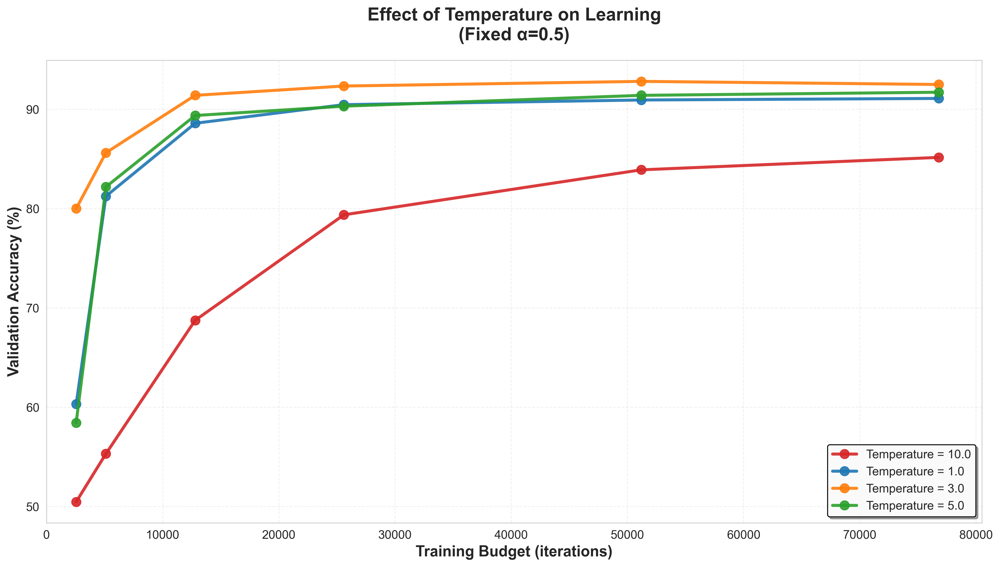
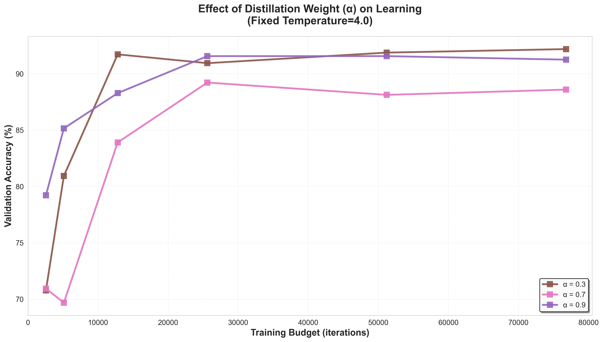
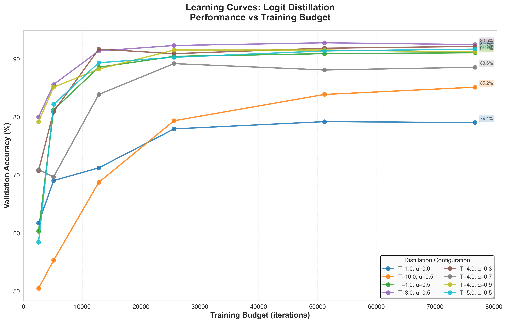
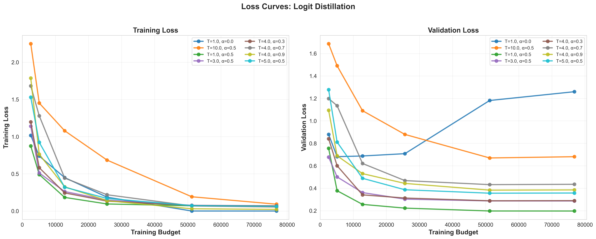

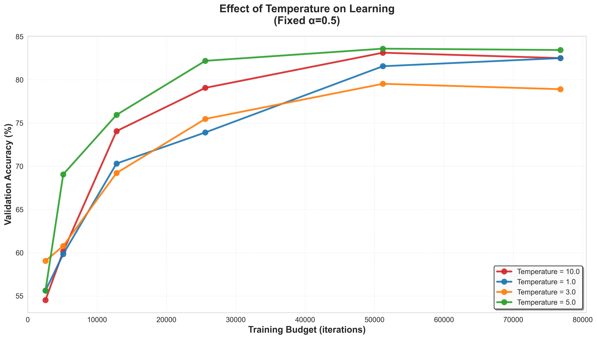
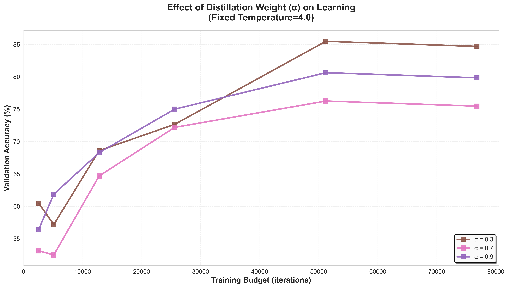
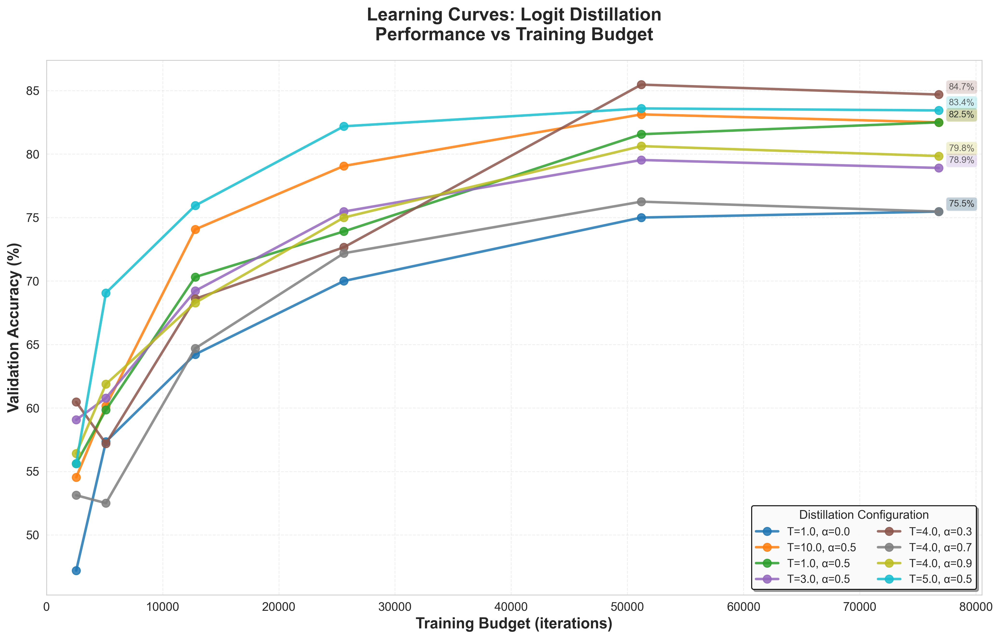
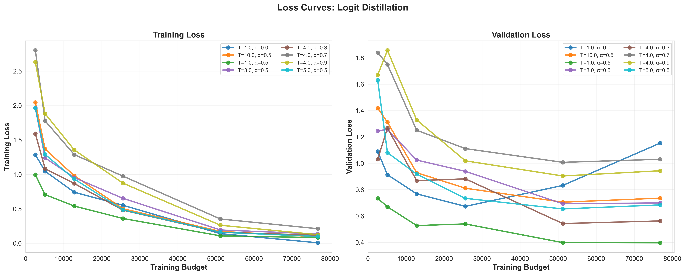

</details>

---

### 2. Feature Distillation
- **Notebook:** `experiments/Task_distillation.ipynb`
- **Objective:** Match intermediate CLS-token features via projection layer + MSE.
- **Hyperparameters explored:** Alpha `α ∈ {0.3, 0.5, 0.7, 0.9}`, Temperature `T ∈ {2, 4, 6}`, projection layer

| Config | Student-S | Student-T |
|--------|:---------:|:---------:|
| Baseline (no KD) | 76.75% | 71.88% |
| α=0.7, proj, T=4 | 90.00% | 79.12% |
| α=0.9, proj, T=4 | 89.00% | **81.88%** ⭐ |
| T=2, α=0.5 | **89.38%** ⭐ | 78.25% |
| α=0.5, proj, T=4 | 88.75% | 74.62% |
| α=0.3, proj, T=4 | 88.25% | 72.12% |
| T=6, α=0.5 | 78.50% | 77.38% |

<details>
<summary>📊 Графики Feature KD</summary>


</details>

---

### 3. Attention Distillation
- **Notebook:** `experiments/Attention_distillation_Small.ipynb`
- **Objective:** Match teacher–student attention maps via MSE / Cosine / L1 loss + CE.
- **Hyperparameters explored:** Alpha `α ∈ {0.3, 0.5, 0.6, 0.7}`, loss `{mse, cosine, l1}`, lr `{1e-4, 2e-4, 5e-5}`

| Config | Student-S | Student-T |
|--------|:---------:|:---------:|
| Baseline (no distill) | 89.25% | 73.25% |
| lr=5e-5 | **92.00%** ⭐ | **82.88%** ⭐ |
| α=0.3, mse | 87.25% | 73.75% |
| α=0.7, mse | 84.50% | 72.75% |
| α=0.5, cosine | 79.62% | 77.75% |
| α=0.6, mse | 77.38% | 75.12% |
| α=0.5, mse | 74.25% | 80.88% |
| α=0.5, l1 | 74.50% | 72.88% |
| lr=2e-4 | 71.25% | 71.00% |

<details>
<summary>📊 Графики Attention KD</summary>


</details>

---

### 4. Contrastive Distillation
- **Notebook:** `experiments/Attention_distillation_Small.ipynb`
- **Objective:** Contrastive feature alignment between teacher and student CLS tokens.
- **Hyperparameters explored:** Alpha `α ∈ {0.3, 0.5, 0.7}`, `T_kd ∈ {2, 6}`, `T_c ∈ {0.05, 0.10}`

| Config | Student-S | Student-T |
|--------|:---------:|:---------:|
| Baseline (no contrast) | 90.75% | 77.88% |
| T_c=0.10 | 91.25% | **87.38%** ⭐ |
| T_kd=2 | 91.00% | 86.38% |
| α=0.3 | **91.62%** ⭐ | 78.75% |
| α=0.5 | 91.12% | 83.50% |
| α=0.7 | 90.62% | 85.12% |
| T_kd=6 | 90.62% | 83.75% |
| T_c=0.05 | 90.38% | 77.00% |

<details>
<summary>📊 Графики Contrastive KD</summary>


</details>

---

## Overall Best Results

| Method | Student-S Best | Student-T Best |
|--------|:-------------:|:-------------:|
| Logit KD | **93.50%** (T=3, α=0.5) | 85.38% (T=5, α=0.5) |
| Feature KD | 89.38% (T=2, α=0.5) | 81.88% (α=0.9, proj) |
| Attention KD | 92.00% (lr=5e-5) | 82.88% (lr=5e-5) |
| Contrastive KD | 91.62% (α=0.3) | **87.38%** (T_c=0.10) |
| Baseline (no KD) | 80.88% | 70.50% |

> **🏆 Student-S:** Logit KD (T=3, α=0.5) → **93.50%** (+12.62% vs baseline)
> **🏆 Student-T:** Contrastive KD (T_c=0.10) → **87.38%** (+16.88% vs baseline)

---

## Visualizations

### Full Comparison (S vs T, all methods)

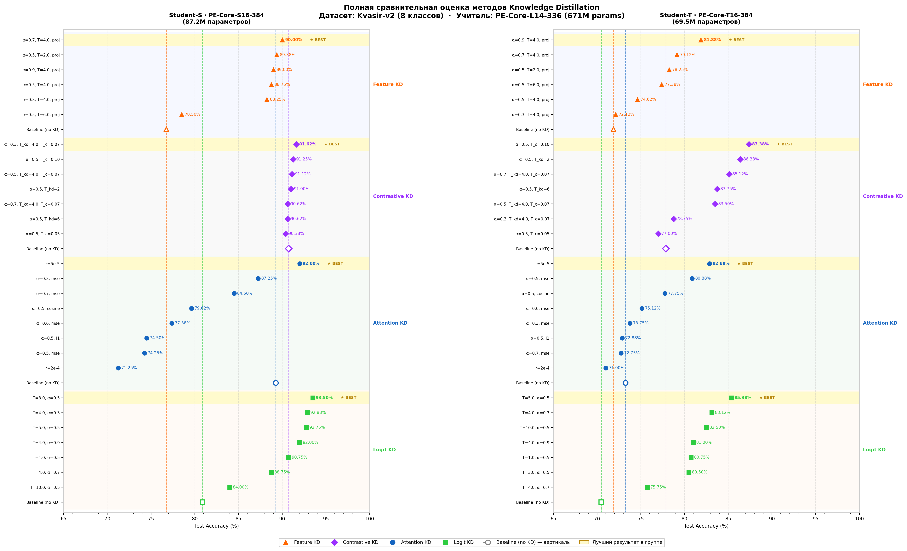

---

### Per-Method Comparison

| | Student-S | Student-T |
|---|---|---|
| **Feature KD** | 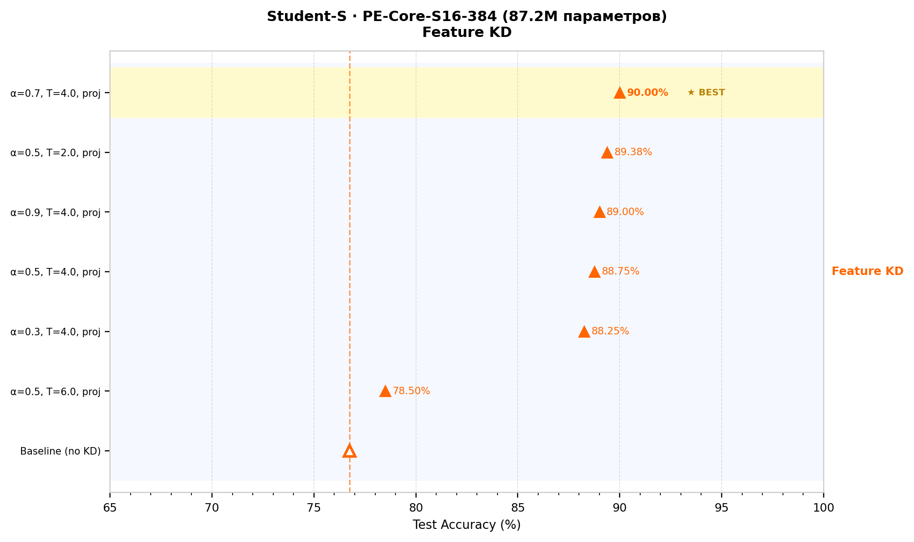 | 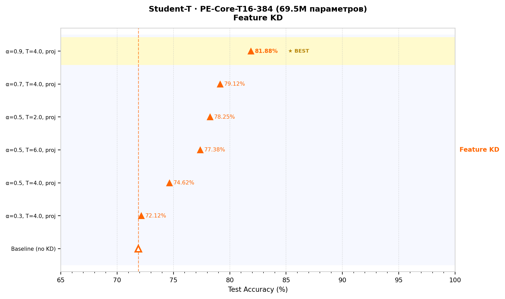 |
| **Contrastive KD** | 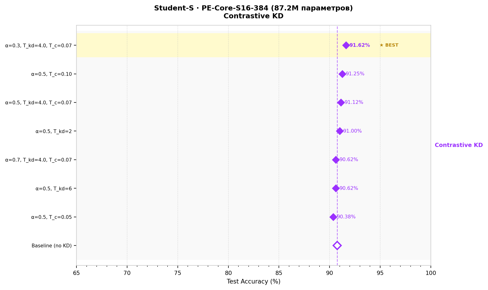 | 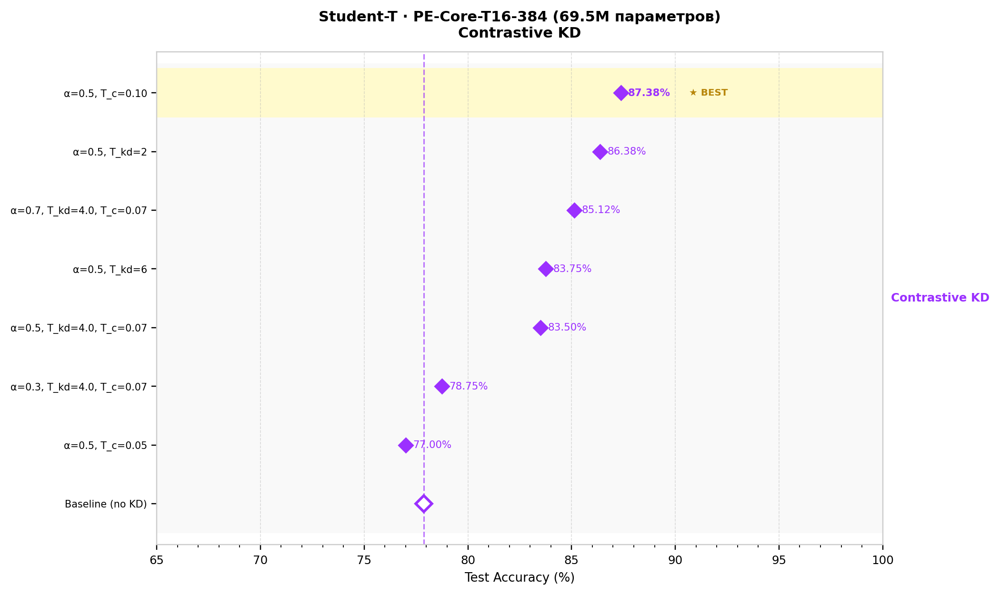 |
| **Attention KD** | 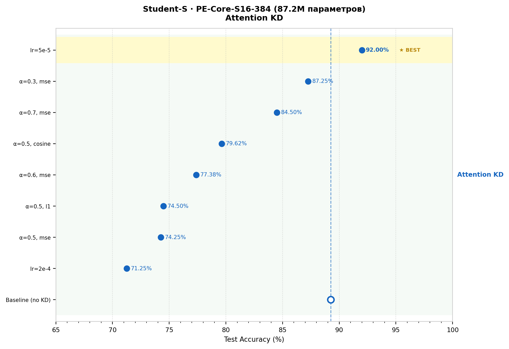 | 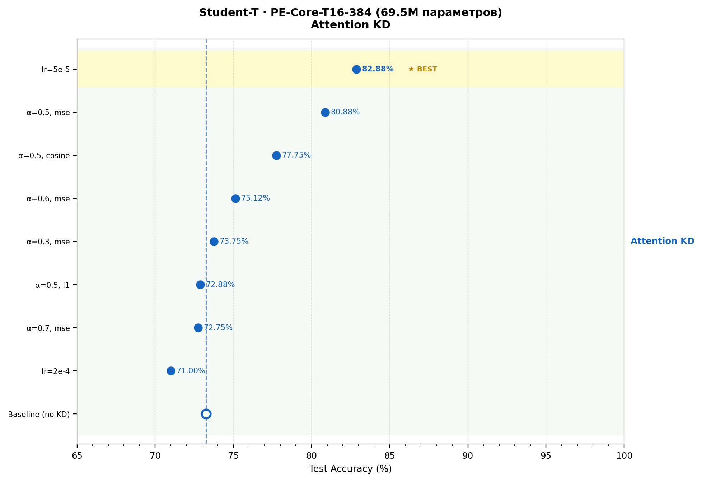 |
| **Logit KD** | 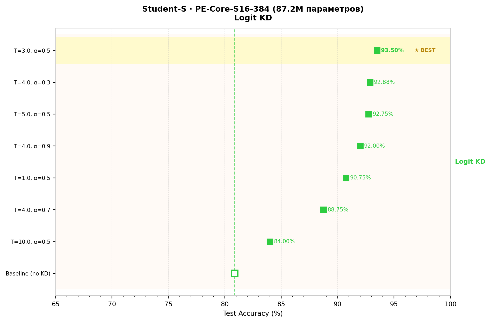 | 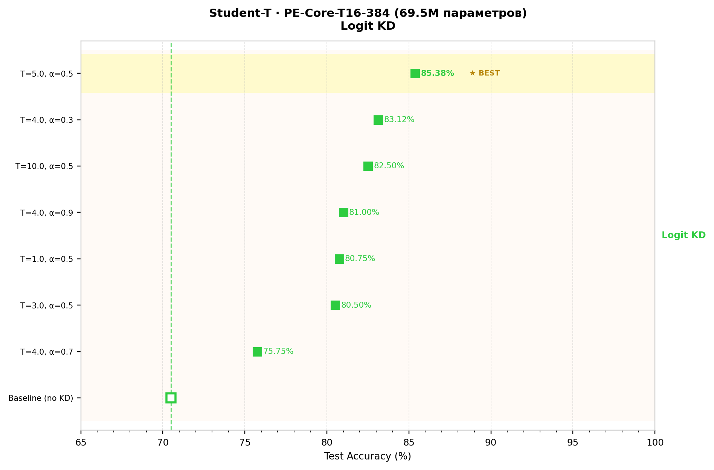 |

---

### Combined Analysis

| График | Описание |
|--------|----------|
| 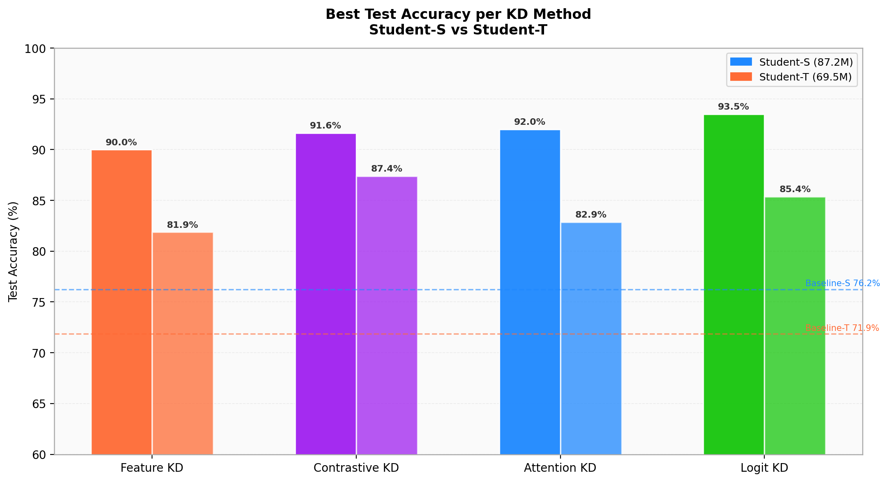 | **Best per method** — лучший результат S и T для каждого метода |
| 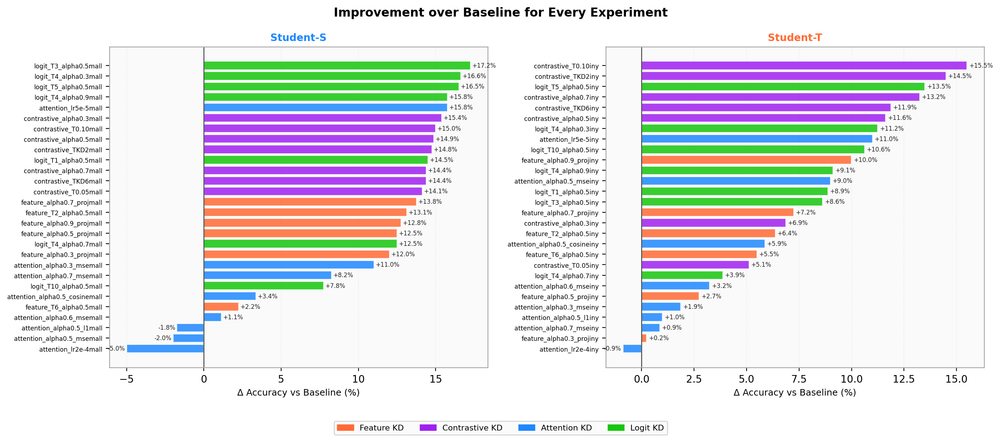 | **Improvement over baseline** — Δ% каждого эксперимента |
| 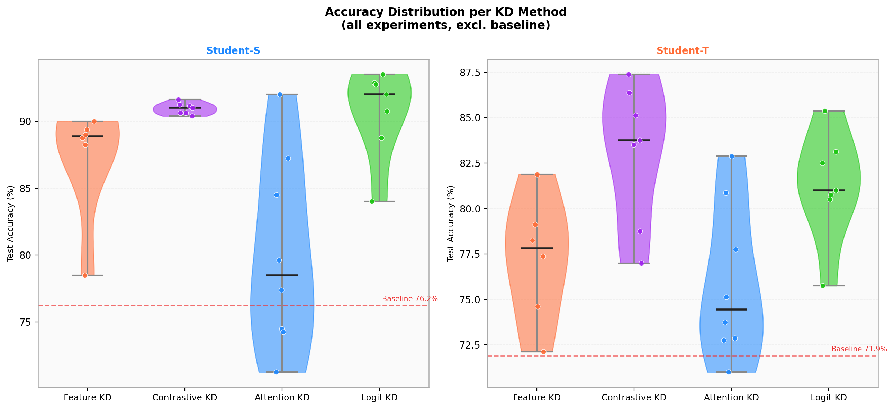 | **Distribution** — разброс accuracy по методам |
| 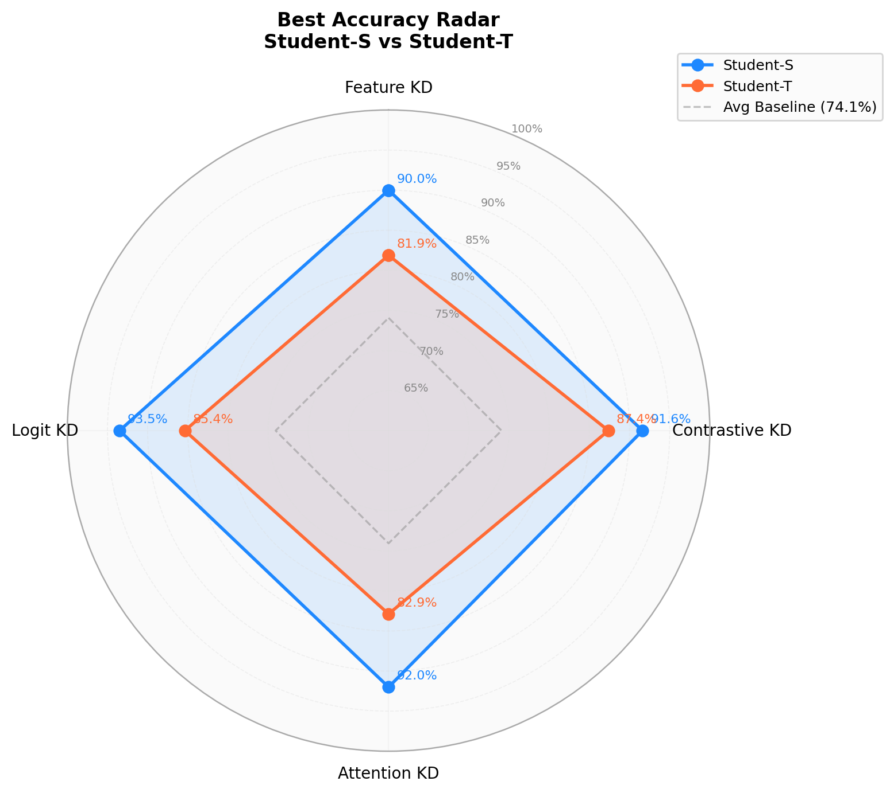 | **Radar chart** — S vs T по всем 4 методам |
| 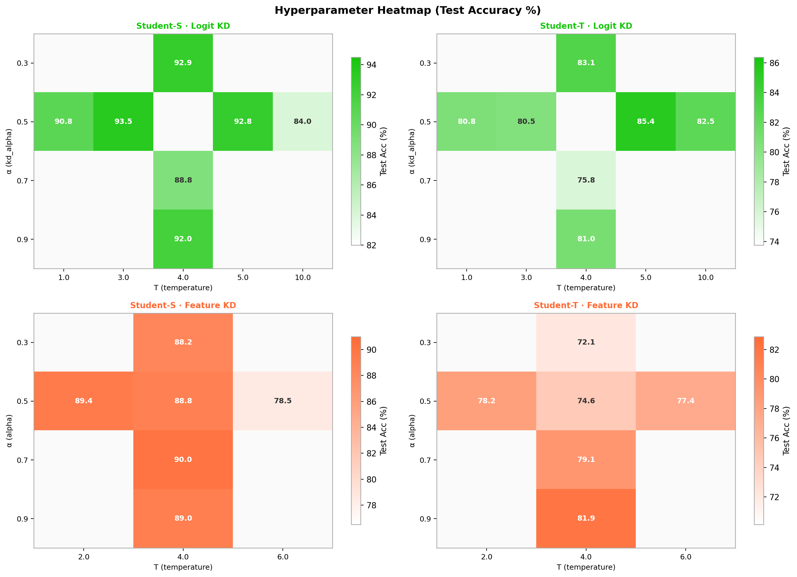 | **Heatmap** — α × T → accuracy для Logit и Feature KD |
| 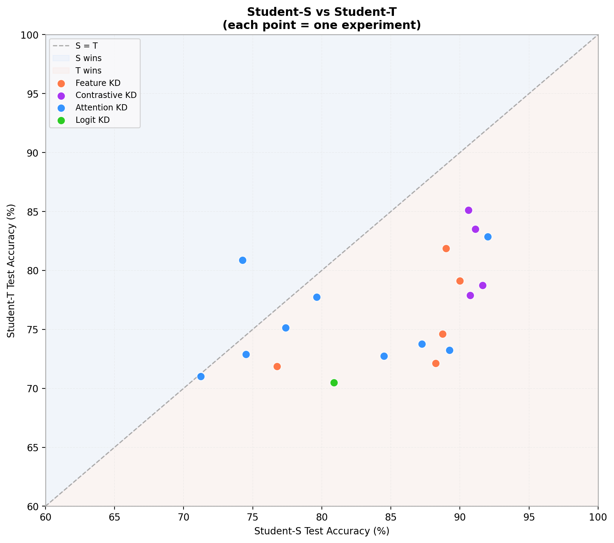 | **Scatter S vs T** — каждая точка = один эксперимент |

---

## Repo Structure

```
ViT_optimization/
├── experiments/                    # Jupyter notebooks
│   ├── Attention_distillation_Small.ipynb
│   ├── Attention_distillation_Tiny.ipynb
│   └── Task_distillation.ipynb
├── results/                        # JSON experiment logs (per run)
│   ├── attention_distillation_S/
│   ├── attention_distillation_t/
│   ├── contrastive_distillation_S/
│   ├── contrastive_distillation_T/
│   ├── feature_distillation_S/
│   ├── feature_distillation_T/
│   ├── logit_distillation_S/
│   └── logit_distillation_T/
├── model_weights/                  # Best checkpoints (.pth)
│   ├── teacher_best.pth
│   ├── small_weights/
│   └── tiny_weights/
├── plots/                          # Generated figures
│   ├── kd_comparison/              # Full comparison + per-method charts
│   ├── combined/                   # Bar, violin, radar, heatmap, scatter
│   ├── attention_distillation_S/
│   ├── attention_distillation_T/
│   ├── contrastive_distillation_S/
│   ├── contrastive_distillation_T/
│   ├── feature_distillation_S/
│   ├── feature_distillation_T/
│   ├── logit_distillation_S/
│   ├── logit_distillation_T/
│   └── quantization_comparison/
├── scripts/                        # Utility scripts
│   ├── plot_kd_comparison.py
│   ├── plot_extra_charts.py
│   └── dump_results.py
└── README.md
```

---

## Reproduce

```powershell
cd "c:\Users\amirn\OneDrive\Рабочий стол\ViT_opti\ViT_optimization"

# Install dependencies
pip install torch torchvision numpy scikit-learn pillow matplotlib

# Dump all results to console
python scripts\dump_results.py

# Main KD comparison charts → plots/kd_comparison/
python scripts\plot_kd_comparison.py

# Extra analysis charts → plots/combined/
python scripts\plot_extra_charts.py
```

> **Note:** Set `NUM_WORKERS = 0` on Windows if `DataLoader` multiprocessing errors occur.

---

## License & Citation

- License: MIT
- If you use these experiments, please cite this repository and the Perception-Encoder sources.